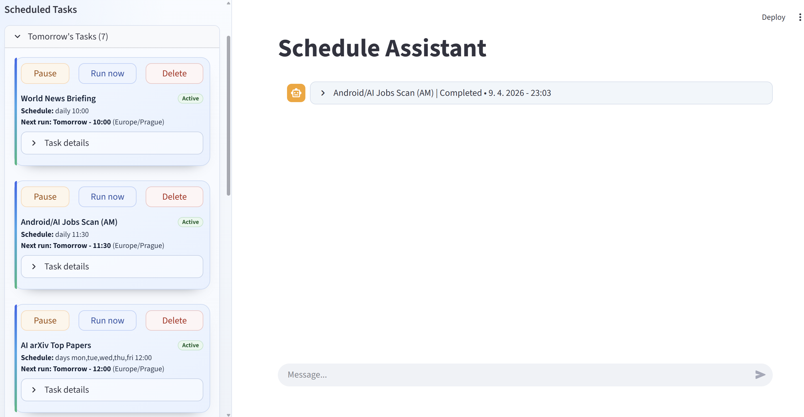

# Schedule Chatbot (LangChain v1 Agent + Streamlit)



This project implements a **reactive + proactive** chatbot:

- Reactive: answers normal chat questions.
- Proactive: executes scheduled tasks on a configurable poll interval and posts results back into chat.

It uses **LangChain v1.0 agent API** (`create_agent`) and a Streamlit chat UI.

## Alternative UI: React Webapp

A separate React frontend + FastAPI backend is available in:

- `react_webapp/`

This keeps Streamlit as backup while giving a smoother client-side UI for large chat histories.
The React backend now uses its own local runtime/tool modules inside `react_webapp/`, so it can run as an isolated unit.
See:

- `react_webapp/README.md`

Quick run (single terminal):

```powershell
cd react_webapp\frontend
npm install
npm run dev:all
```

### React Webapp Preview


React webapp highlights:

- Smooth client-side chat with collapsible scheduled-result cards
- Streaming assistant responses in normal conversation
- Task grouping (`Today / Yesterday / Future`) with task operations in sidebar
- Standalone backend runtime isolated under `react_webapp/`

## Features

- LangChain v1 agent with tool-calling.
- Streamlit chatbot interface.
- Recurring scheduler (`APScheduler`) that checks due tasks on a configurable interval.
- Sidebar task management: pause/resume tasks, edit task text, and delete tasks.
- Task titles are required when creating schedules and are shown on each task card.
- Tools:
  - `web_search`: web search via LangChain `TavilySearch`; supports `start_date` and optional country boosting.
  - `parse_websites`: fetch + parse multiple website URLs.
  - `open_file`: read local TXT/Word/Excel/OpenDocument files and return extracted content in markdown.
  - `run_windows_cmd`: run Windows `cmd /c` commands.
  - `schedule_task`, `list_scheduled_tasks`, `remove_scheduled_task`.
- Persistent state in `data/state.json`.

## Requirements

- Python 3.10+
- Chat model provider API key:
  - Google Gemini: `GOOGLE_API_KEY`
- `TAVILY_API_KEY` set (for `web_search`)

Create and activate a virtual environment (recommended):

```bash
python -m venv .venv
.venv\Scripts\activate
```

Install dependencies:

```bash
pip install -r requirements.txt
```

## Run

```bash
streamlit run app.py
```

Optional env vars:

- `AGENT_MODEL` (default: `gemini-3-flash-preview`)
- `GOOGLE_API_KEY` (required)
- `GEMINI_INCLUDE_THOUGHTS` (default: `true`, request Gemini thought blocks for reasoning logs)
- `GEMINI_THINKING_LEVEL` (default: `low`, options: `minimal|low|medium|high`)
- `GEMINI_THINKING_BUDGET` (optional int; mainly for Gemini 2.5, ignored when `thinking_level` is used)
- `MODEL_TEMPERATURE` (default: `0.0`, range `0.0..2.0`, lower = more consistent)
- `TAVILY_API_KEY` (required for `web_search`)
- `WEB_SEARCH_MAX_RESULTS` (default: `6`, range `1..10`)
- `TAVILY_SEARCH_DEPTH` (default: `advanced`, options: `basic|advanced`)
- `TAVILY_TOPIC` (default: `general`, options: `general|news|finance`)
- `TAVILY_INCLUDE_DOMAINS` (optional CSV list of domains)
- `TAVILY_EXCLUDE_DOMAINS` (optional CSV list of domains)
- `EVENT_POLL_MS` (default: `500`, event polling interval for scheduled-task updates)
- `SUPPRESS_WINDOWS_ALERT_WHEN_UI_ACTIVE` (default: `true`, skip Windows alert when chatbot page is actively refreshing)
- `UI_ACTIVE_WINDOW_SECONDS` (default: `8`, heartbeat window used to decide if UI is active)
- `SCHEDULER_POLL_SECONDS` (default: `60`)
- `PLAYWRIGHT_REUSE_BROWSER` (default: `true`, keeps Chromium alive and reuses it)
- `PLAYWRIGHT_STARTUP_TIMEOUT_SECONDS` (default: `30`, startup warmup timeout)
- `PLAYWRIGHT_MAX_CONCURRENCY` (default: `4`, range `1..8` for `parse_websites`)
- `PLAYWRIGHT_RENDER_WAIT_MS` (default: `120`, extra wait after navigation)
- `PLAYWRIGHT_PAGE_TIMEOUT_SECONDS` (default: `15`, per-page timeout)
- `PLAYWRIGHT_WAIT_UNTIL` (default: `domcontentloaded`, options: `commit|domcontentloaded|load|networkidle`)
- `PLAYWRIGHT_BLOCK_RESOURCE_TYPES` (default: `image,media,font`, CSV resource types to skip while loading)
- `AGENT_TRACE_ENABLED` (default: `true`, enables local agent tracing to file)
- `AGENT_TRACE_FILE` (default: `data/agent_trace.log`)
- `AGENT_TRACE_FORMAT` (default: `pretty`, options: `pretty|jsonl`)
- `AGENT_TRACE_MAX_TEXT_CHARS` (default: `8000`, max chars per text field in trace events)
- `AGENT_GRAPH_DEBUG` (default: `false`, enables `create_agent(debug=True)` graph diagnostics)
- `MAX_TOOL_CALLS_PER_RUN` (default: `10`, enforced via LangChain `ToolCallLimitMiddleware` per `agent.invoke` run)

## Schedule Formats

The scheduling tool supports:

- `daily HH:MM`
- `weekly DAY HH:MM` (DAY: `mon,tue,wed,thu,fri,sat,sun`)
- `days DAY1,DAY2 HH:MM` (example: `days mon,wed,fri 09:30`)
- `every N minutes`
- `cron: M H DOM MON DOW`

Timezone is provided separately (examples: `UTC`, `America/New_York`).

## Example prompts

- `What are the top AI headlines today?`
- `Create a task titled "AI News NYC Morning" that runs daily at 09:00 in America/New_York and summarizes AI headlines.`
- `Create a task titled "Frequent Web Digest" that runs every 30 minutes and parses cnn.com and bbc.com with a short summary.`
- `Create a task titled "Morning AI News" that runs daily at 09:00 in Europe/Prague and summarizes top AI headlines.`
- `Run this command and explain output: dir C:\\`
- `List my scheduled tasks.`
- `Remove scheduled task ab12cd34`

## Notes

- `run_windows_cmd` executes commands on the local machine. Use carefully.
- Scheduler poll interval is configurable via `SCHEDULER_POLL_SECONDS` (default 60s).
