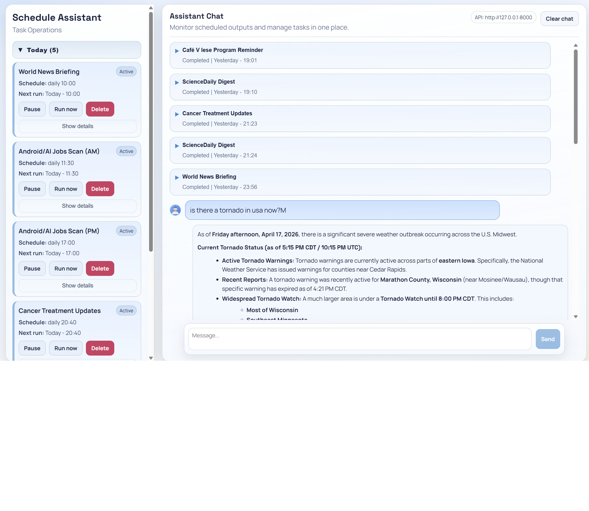

# React UI (FastAPI + React)

This is the new web UI for this project.

- API runs on `http://127.0.0.1:8000`
- UI runs on `http://127.0.0.1:5173`



## Highlights

- Streaming assistant replies for normal conversation
- Collapsible scheduled output cards with unread state
- Sidebar task operations grouped by `Today / Yesterday / Future`
- Single-command local run with auto cleanup of old ports (`npm run dev:all`)

## Standalone design

`react_webapp` now includes its own runtime + tool modules:

- `runtime.py`, `runtime_agent.py`, `runtime_store.py`, `runtime_tools.py`, etc.
- `tools/` (local copy used by the React backend)

The API imports these local modules (`react_webapp.*`) and does not depend on root `runtime*.py` files.
State and trace files are also local to this unit:

- `react_webapp/data/state.json`
- `react_webapp/data/agent_trace.log`

## 1) First-time setup

From repo root:

```powershell
cd react_webapp\frontend
npm install
```

## 2) Run everything in one terminal (recommended)

From `react_webapp\frontend`:

```powershell
npm run dev:all
```

This starts both:

- FastAPI backend (`uvicorn`)
- React frontend (`vite`)

Before starting, it automatically kills old listeners on ports `8000` and `5173` to prevent stale-process conflicts.

Open:

- UI: `http://127.0.0.1:5173`
- API health: `http://127.0.0.1:8000/api/health`

Stop both with `Ctrl + C`.

## 3) If you want to run them separately

Terminal A (repo root):

```powershell
py -3 -m uvicorn react_webapp.backend_api:app --host 127.0.0.1 --port 8000 --reload
```

Terminal B:

```powershell
cd react_webapp\frontend
npm run dev
```

## 4) Optional frontend env file

Create `react_webapp\frontend\.env`:

```text
VITE_API_BASE_URL=http://127.0.0.1:8000
```

If not set, the app still defaults to `http://127.0.0.1:8000`.

## 5) Production build (static files)

From `react_webapp\frontend`:

```powershell
npm run build
```

Build output is created in:

- `react_webapp\frontend\dist`

## Troubleshooting

- If `npm run dev:all` says `concurrently` is missing, run `npm install` again in `react_webapp\frontend`.
- If port `8000` or `5173` is busy, stop the old process first, then rerun.
- If UI is up but no data loads, check `http://127.0.0.1:8000/api/health`.
